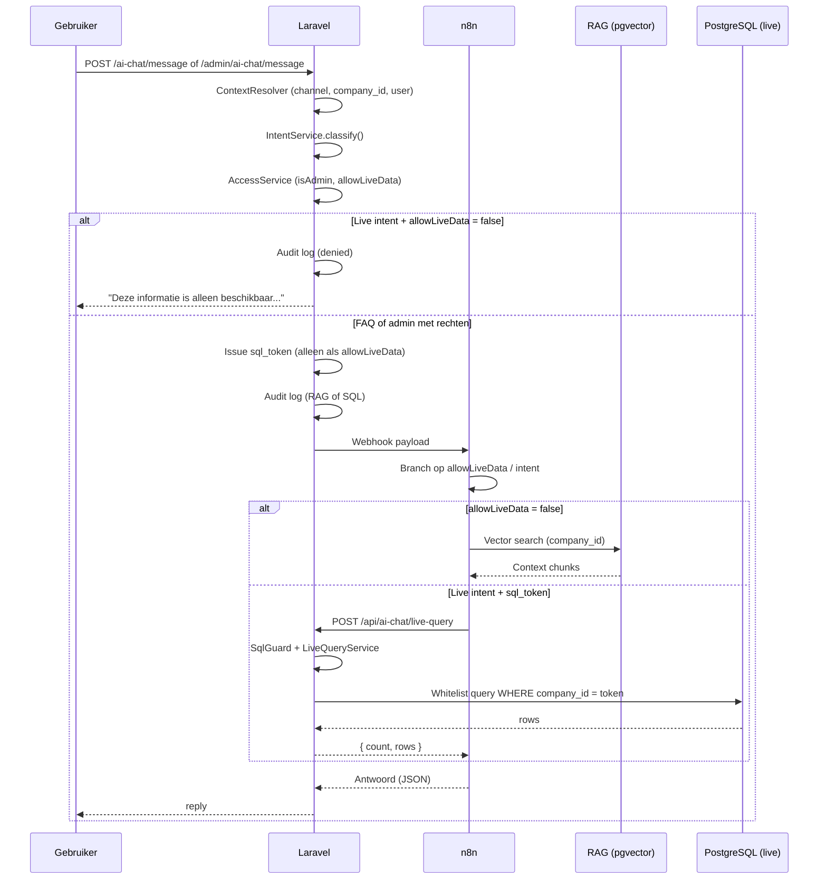

# Nexa Taxi AI-assistent — RBAC architectuur

Rolgebaseerde toegangscontrole voor RAG (kennisbank) versus live database queries via n8n.

## Overzicht

| Kanaal | Gebruiker | Live data | Publieke tarieven | Datasource |
|--------|-----------|-----------|-------------------|------------|
| `public` | Websitebezoeker | Nee | Ja (intent `tarieven`) | RAG + `default_rates` |
| `admin` | Ingelogde medewerker met rechten | Ja (bij live intent) | Ja | RAG + SQL gateway |

De frontend stuurt **nooit** `role` of `isAdmin`. Laravel bepaalt dit server-side op basis van sessie, kanaal en Spatie-permissies.

## Componenten (Laravel)

```
app/
├── DTO/AiChat/
│   ├── AiChatRequestContext.php      # company_id, channel, user, module
│   ├── AiChatIntentResult.php        # intent, isAdmin, allowLiveData, allowPublicRates
│   └── AiChatWebhookPayload.php      # payload naar n8n
├── Enums/AiChat/
│   ├── AiChatIntent.php              # faq, tarieven, ritten_morgen, …
│   ├── AiChatChannel.php             # public, admin
│   └── AiChatDataSource.php          # rag, sql, public_rates, denied
├── Services/AiChat/
│   ├── AiChatContextResolver.php     # bouwt context uit request
│   ├── AiChatIntentService.php       # intent + toegang
│   ├── AiChatAccessService.php       # permissie-checks
│   ├── AiChatAssistantOrchestrator.php
│   ├── AiChatSqlTokenService.php     # encrypted sql_token
│   ├── AiChatSqlGuardService.php     # allowLiveData + company_id guard
│   ├── AiChatLiveQueryService.php    # vooraf gedefinieerde queries
│   ├── AiChatPublicRatesFormatter.php
│   └── AiChatAuditLogger.php
├── Http/Controllers/
│   ├── Frontend/AiChatController.php       # POST /ai-chat/message
│   ├── Admin/AdminAiChatController.php       # POST /admin/ai-chat/message
│   └── Api/AiChatSqlController.php           # POST /api/ai-chat/live-query
└── Models/AiChatAuditLog.php
```

## Endpoints

| Route | Auth | Beschrijving |
|-------|------|--------------|
| `POST /ai-chat/message` | Geen (throttle) | Publieke chatwidget |
| `POST /admin/ai-chat/message` | `admin` middleware + permissies | Admin chat |
| `POST /api/ai-chat/live-query` | `sql_token` (n8n) | SQL gateway |

## Webhook payloads (Laravel → n8n)

**Publiek:**

```json
{
  "company_id": 1,
  "channel": "public",
  "module": "taxi",
  "message": "Hebben jullie luchthavenvervoer?",
  "intent": "faq",
  "isAdmin": false,
  "allowLiveData": false
}
```

**Publiek (tarieven):**

```json
{
  "company_id": 1,
  "channel": "public",
  "module": "taxi",
  "message": "Wat zijn jullie tarieven?",
  "intent": "tarieven",
  "isAdmin": false,
  "allowLiveData": false,
  "allowPublicRates": true,
  "sql_token": "<encrypted>",
  "laravel_live_query_url": "https://jouw-domein.nl/api/ai-chat/live-query"
}
```

**Admin (live intent):**

```json
{
  "company_id": 1,
  "channel": "admin",
  "user_id": 15,
  "role": "admin",
  "module": "taxi",
  "message": "Welke ritten staan morgen gepland?",
  "intent": "ritten_morgen",
  "isAdmin": true,
  "allowLiveData": true,
  "sql_token": "<encrypted>"
}
```

| Intent | Voorbeeldvraag | Publiek | Admin live |
|--------|----------------|---------|------------|
| `faq` | Diensten, annuleren, luchthaven | RAG | RAG |
| `tarieven` | Wat kost een rit? Instaptarief? | `default_rates` via API | `default_rates` via API |
| `ritten_morgen` | Ritten morgen gepland | Geweigerd | SQL gateway |
| `vrije_chauffeurs_morgen` | Beschikbare chauffeurs morgen | Geweigerd | SQL gateway |
| `ritten_vandaag` | Hoeveel ritten vandaag | Geweigerd | SQL gateway |
| `open_ritten` | Ritten wachten op bevestiging | Geweigerd | SQL gateway |

## Beslislogica

```text
Als intent = faq:
    gebruik RAG kennisbank

Als intent = tarieven:
    gebruik Laravel /api/ai-chat/live-query (alleen default_rates)

Als intent = operationele vraag en gebruiker is admin:
    gebruik Laravel /api/ai-chat/live-query (whitelist SQL)

Als intent = operationele vraag en gebruiker is geen admin:
    geef beveiligde melding terug (Laravel, vóór n8n)
```

## Publieke tarieven

- Tabel: `default_rates` (configureerbaar via `AI_CHAT_PUBLIC_RATES_TABLE`)
- Geen `company_id` kolom — tenant-isolatie via module-database/schema
- Tarieven worden **niet** door AI verzonnen; Laravel formatteert antwoord uit DB
- Response: `{ "answer": "...", "source": "public_rates" }`

Verboden tabellen voor publieke gebruikers: `ride_requests`, `users`, `customers`, `drivers`, `vehicles`, `invoices`, `bookings`, `payments`

## Intent classificatie (legacy sectie)

| Intent | Voorbeeldvraag | Live data |
|--------|----------------|-----------|
| `faq` | Tarieven, diensten, annuleren | Nee |
| `ritten_morgen` | Ritten morgen gepland | Ja (admin) |
| `vrije_chauffeurs_morgen` | Beschikbare chauffeurs morgen | Ja (admin) |
| `ritten_vandaag` | Hoeveel ritten vandaag | Ja (admin) |
| `open_ritten` | Ritten wachten op bevestiging | Ja (admin) |

## Security flow

1. **IntentService** classificeert de vraag.
2. **AccessService** zet `isAdmin` / `allowLiveData` (kanaal + permissies).
3. Live intent + `allowLiveData === false` → vaste denial-tekst, **geen** n8n-call.
4. Anders → webhook naar n8n met RBAC-velden.
5. n8n: als `allowLiveData === true` → `POST /api/ai-chat/live-query` met `sql_token`.
6. **SqlGuard** weigert als token ongeldig, verlopen, intent mismatch, of `allow_live_data !== true`.
7. **LiveQueryService** voert alleen whitelist-queries uit, altijd `WHERE company_id = ?` uit token.

### Admin-permissies (minimaal één)

- `ai_chatbot.view`
- `rides.view`
- `vehicles.view`
- `rides.update`
- of rol `super-admin`

## n8n workflow

Geïmporteerde workflow: [`docs/n8n/Nexa-Taxi-RAG-PostgreSQL-Assistant.json`](n8n/Nexa-Taxi-RAG-PostgreSQL-Assistant.json)

Belangrijk na import:

1. Vervang `https://JOUW-DOMEIN.nl` in node **Laravel live query API** (of vertrouw op `laravel_live_query_url` uit Laravel payload).
2. Koppel OpenAI-credentials aan node **Maak embedding** (geen API-key in JSON).
3. Verwijder oude node **Lees live taxi database** — directe PostgreSQL-queries voor ritten/chauffeurs zijn vervangen door de Laravel API.

## n8n flow (aanbevolen)

```
Webhook
  → Normaliseer Laravel payload (intent, allowLiveData, allowPublicRates, sql_token)
  → IF intent === faq → RAG kennisbank
  → ELSE IF intent === tarieven OR allowLiveData === true
      → HTTP POST Laravel /api/ai-chat/live-query
  → ELSE → "Deze informatie is alleen beschikbaar..."
```

**Belangrijk:** gebruik `company_id` uitsluitend uit de Laravel payload, nooit uit de gebruikersvraag. n8n voert **geen** vrije SQL meer uit op operationele tabellen.

## Sequence diagram



## Audit logging

Tabel `ai_chat_audit_logs`:

| Kolom | Beschrijving |
|-------|--------------|
| `company_id` | Tenant |
| `user_id` | Null voor publiek |
| `channel` | public / admin |
| `intent` | Geclassificeerde intent |
| `is_admin` | Server-side |
| `message` | Gebruikersvraag (max. lengte) |
| `data_source` | rag / sql / denied |

## Configuratie (.env)

```env
# VERPLICHT als n8n extern draait (n8n.nexasuite.nl kan geen localhost bereiken):
AI_CHAT_LARAVEL_API_URL=https://nexasuite.nl

N8N_AI_CHAT_HMAC_SECRET=          # Optioneel: HMAC voor n8n → Laravel
AI_CHAT_SQL_TOKEN_TTL=120         # sql_token geldigheid (seconden)
```

In n8n **Variables** (fallback): `LARAVEL_API_URL=https://nexasuite.nl`

Test vanaf je laptop:
`curl -sS -X POST https://nexasuite.nl/api/ai-chat/live-query -H 'Content-Type: application/json' -d '{"intent":"tarieven","sql_token":"x","company_id":1}'`
(verwacht 403 met ongeldig token — dat bewijst dat de route bereikbaar is)

Webhook-URL's blijven in `services.ai_chat` / GeneralSettings per module.

## Voorbeeld: publieke weigering

```php
// AiChatAssistantOrchestrator
if ($intentResult->intent->requiresLiveData() && ! $intentResult->allowLiveData) {
    $this->auditLogger->log($context, $intentResult, $message, AiChatDataSource::Denied);
    return config('ai_chat.live_data_denied_message');
}
```

## Voorbeeld: SQL guard

```php
// AiChatSqlGuardService
public function assertMayExecute(array $claims): void
{
    if (($claims['allow_live_data'] ?? false) !== true) {
        throw new RuntimeException('Live data queries zijn niet toegestaan.');
    }
}
```

## Tests

- `tests/Unit/AiChatIntentServiceTest.php` — classificatie + toegang
- `tests/Unit/AiChatAssistantServiceTest.php` — webhook payload + publieke weigering
- `tests/Feature/AiChatSqlGatewayTest.php` — token validatie + gateway
