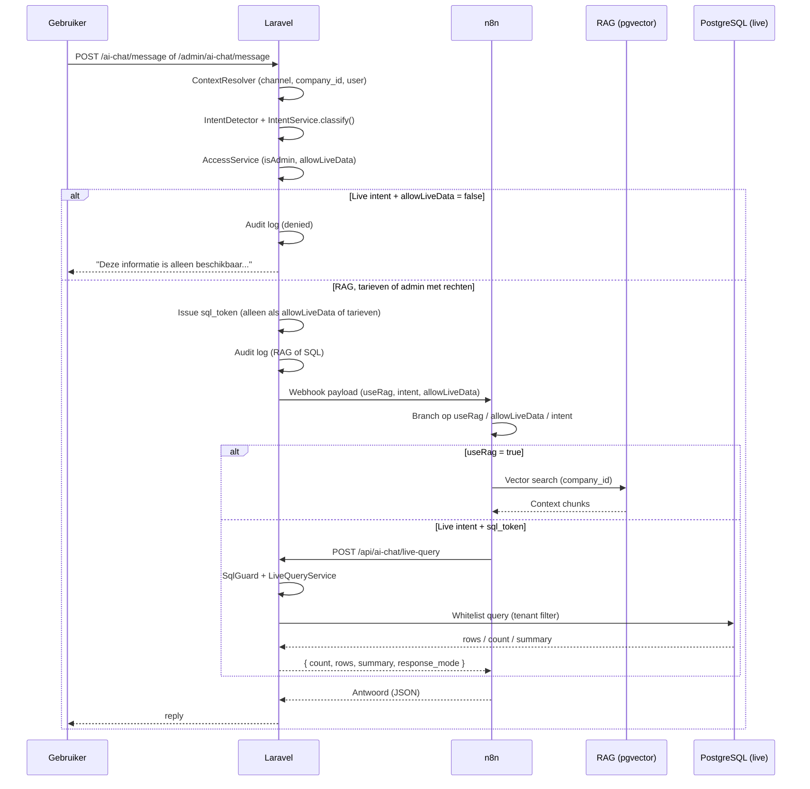

# Nexa Taxi AI-assistent — RBAC architectuur

Rolgebaseerde toegangscontrole voor RAG (kennisbank), publieke tarieven en live database queries via n8n.

## Overzicht

| Kanaal | Gebruiker | Live data | Publieke tarieven | Datasource |
|--------|-----------|-----------|-------------------|------------|
| `public` | Websitebezoeker (niet ingelogd) | Nee | Ja (intent `tarieven`) | RAG + `default_rates` |
| `mijn_taxi` | Ingelogde klant in Mijn Taxi | Alleen eigen ritten (`mijn_rit`) | Ja | RAG + SQL (eigen ritten) |
| `admin` | Ingelogde medewerker met rechten | Ja (bij live intent) | Ja | RAG + SQL gateway |

De frontend stuurt **nooit** `role` of `isAdmin`. Laravel bepaalt dit server-side op basis van sessie, kanaal en Spatie-permissies.

## Componenten (Laravel)

```
app/
├── DTO/AiChat/
│   ├── AiChatRequestContext.php      # company_id, channel, user, module
│   ├── AiChatIntentResult.php        # intent, isAdmin, allowLiveData, queryHint, responseMode
│   └── AiChatWebhookPayload.php      # payload naar n8n (incl. useRag)
├── Enums/AiChat/
│   ├── AiChatIntent.php              # faq, diensten, tarieven, ritten_morgen, …
│   ├── AiChatChannel.php             # public, mijn_taxi, admin
│   ├── AiChatDataSource.php          # rag, sql, public_rates, denied
│   └── AiChatResponseMode.php        # list, count, summary
├── Services/AiChat/
│   ├── AiChatContextResolver.php     # bouwt context uit request
│   ├── AiChatIntentDetector.php      # keyword-classificatie
│   ├── AiChatIntentService.php       # intent + toegang
│   ├── AiChatAccessService.php       # permissie-checks + mijn_rit
│   ├── AiChatTaxiRoleQueryService.php # chauffeur-rol via Spatie
│   ├── AiChatAssistantOrchestrator.php
│   ├── AiChatSqlTokenService.php     # encrypted sql_token
│   ├── AiChatSqlGuardService.php     # allowLiveData + company_id guard
│   ├── AiChatLiveQueryService.php    # vooraf gedefinieerde queries
│   ├── AiChatPublicRatesFormatter.php
│   └── AiChatAuditLogger.php
├── Http/Controllers/
│   ├── Frontend/AiChatController.php       # POST /ai-chat/message
│   ├── Admin/AdminAiChatController.php     # POST /admin/ai-chat/message
│   └── Api/AiChatSqlController.php       # POST /api/ai-chat/live-query
└── Models/AiChatAuditLog.php
```

## Endpoints

| Route | Auth | Beschrijving |
|-------|------|--------------|
| `POST /ai-chat/message` | Geen (throttle) | Publieke chatwidget (geen user-context) |
| `POST /mijn-taxi/api/ai-chat/message` | `auth` + `taxi.portal` | Mijn Taxi chat (eigen ritten) |
| `POST /admin/ai-chat/message` | `admin` middleware + permissies | Admin chat |
| `POST /api/ai-chat/live-query` | `sql_token` (n8n) | SQL gateway |

## Intent-structuur

### Publiek (websitebezoeker)

| Intent | Voorbeeldvraag | Datasource |
|--------|----------------|------------|
| `diensten` | Hebben jullie luchthavenvervoer? Rijden jullie naar Duitsland? | RAG |
| `tarieven` | Wat kost een rit? Instaptarief? Schiphol-rit? | `default_rates` |
| `reserveren` | Hoe reserveer ik een taxi? Kan ik online betalen? | RAG |
| `annuleren` | Hoe annuleer ik? Annuleringsvoorwaarden? | RAG |
| `betalen` | Welke betaalmethoden? Kan ik pinnen? | RAG |
| `contact` | Telefoonnummer? Openingstijden? Vestiging? | RAG |
| `faq` | Overige algemene vragen | RAG |

### Ingelogde klant (Mijn Taxi, rol `klant`)

| Intent | Voorbeeldvraag | Toegang |
|--------|----------------|---------|
| `mijn_rit` | Wanneer word ik opgehaald? Wie is mijn chauffeur? | Alleen eigen ritten (`customer_user_id`) |

### Admin (medewerker met rechten)

| Intent | Voorbeeldvraag |
|--------|----------------|
| `ritten_morgen` | Welke ritten staan morgen gepland? |
| `ritten_vandaag` | Welke ritten staan vandaag gepland? Hoeveel ritten vandaag? |
| `ritten_komend` | Welke ritten heb ik? (generiek) |
| `open_ritten` | Welke ritten moeten nog bevestigd worden? |
| `ritten_geannuleerd` | Welke ritten zijn geannuleerd? |
| `ritten_zonder_chauffeur` | Welke ritten hebben geen chauffeur? |
| `ritten_zonder_voertuig` | Welke ritten hebben nog geen voertuig? |
| `ritten_luchthaven_morgen` | Welke luchthavenritten staan morgen gepland? |
| `ritten_voor_08` | Welke ritten vertrekken voor 08:00? |
| `ritten_lang` | Welke ritten duren langer dan 1 uur? |
| `vrije_chauffeurs_morgen` | Welke chauffeurs zijn morgen beschikbaar? |
| `chauffeurs_vandaag` | Welke chauffeurs hebben vandaag ritten? |
| `chauffeurs_meeste_ritten_vandaag` | Welke chauffeur heeft de meeste ritten vandaag? |
| `chauffeurs_zonder_rit` | Welke chauffeurs hebben nog geen rit? |
| `chauffeurs_schiphol_morgen` | Welke chauffeur rijdt morgen naar Schiphol? |
| `chauffeurs_onderweg` | Welke chauffeurs zijn momenteel onderweg? |
| `klanten_meeste_ritten` | Welke klanten hebben de meeste ritten geboekt? |
| `klanten_deze_maand` | Welke klanten hebben deze maand een rit geboekt? |
| `klanten_luchthaven` | Welke klanten hebben een luchthavenrit gepland? |
| `klanten_geannuleerd` | Welke klanten hebben een rit geannuleerd? |
| `klanten_nieuw_deze_maand` | Welke klanten zijn nieuw deze maand? |
| `omzet_vandaag` | Wat is de omzet van vandaag? |
| `omzet_morgen` | Wat is de verwachte omzet van morgen? |
| `planning` | Dubbel ingeplande chauffeurs, overlappende ritten, ritten binnen een uur |
| `voertuigen_morgen` | Welke voertuigen zijn morgen ingepland? |
| `voertuigen_beschikbaar` | Welke voertuigen zijn beschikbaar? |

**Startset (≈80% dagelijks gebruik):** `diensten`, `tarieven`, `ritten_morgen`, `vrije_chauffeurs_morgen`, `omzet_vandaag`.

## Webhook payloads (Laravel → n8n)

**Publiek (diensten / RAG):**

```json
{
  "company_id": 1,
  "channel": "public",
  "module": "taxi",
  "message": "Hebben jullie luchthavenvervoer?",
  "intent": "diensten",
  "useRag": true,
  "isAdmin": false,
  "allowLiveData": false
}
```

**Publiek (tarieven):**

```json
{
  "company_id": 1,
  "channel": "public",
  "module": "taxi",
  "message": "Wat zijn jullie tarieven?",
  "intent": "tarieven",
  "useRag": false,
  "isAdmin": false,
  "allowLiveData": false,
  "allowPublicRates": true,
  "sql_token": "<encrypted>",
  "laravel_live_query_url": "https://jouw-domein.nl/api/ai-chat/live-query"
}
```

**Admin (live intent):**

```json
{
  "company_id": 1,
  "channel": "admin",
  "user_id": 15,
  "role": "admin",
  "module": "taxi",
  "message": "Welke ritten staan morgen gepland?",
  "intent": "ritten_morgen",
  "useRag": false,
  "isAdmin": true,
  "allowLiveData": true,
  "sql_token": "<encrypted>"
}
```

**Klant (eigen rit):**

```json
{
  "company_id": 1,
  "channel": "mijn_taxi",
  "user_id": 42,
  "role": "klant",
  "message": "Wanneer word ik opgehaald?",
  "intent": "mijn_rit",
  "useRag": false,
  "allowLiveData": true,
  "sql_token": "<encrypted>"
}
```

## Beslislogica

```text
Als intent gebruikt RAG (useRag = true):
    gebruik RAG kennisbank

Als intent = tarieven:
    gebruik Laravel /api/ai-chat/live-query (alleen default_rates)

Als intent = operationele vraag en allowLiveData = true:
    gebruik Laravel /api/ai-chat/live-query (whitelist SQL)

Als intent = operationele vraag en allowLiveData = false:
    geef beveiligde melding terug (Laravel, vóór n8n):
    "Deze informatie is alleen beschikbaar voor geautoriseerde medewerkers."
```

Publieke gebruikers die operationele vragen stellen (ritten, chauffeurs, omzet, klanten) worden geclassificeerd met het juiste admin-intent, maar `allowLiveData` blijft `false` — Laravel weigert vóór n8n.

## Publieke tarieven

- Tabel: `default_rates` (configureerbaar via `AI_CHAT_PUBLIC_RATES_TABLE`)
- Geen `company_id` kolom — tenant-isolatie via module-database/schema
- Tarieven worden **niet** door AI verzonnen; Laravel formatteert antwoord uit DB
- Response: `{ "answer": "...", "source": "public_rates" }`

Verboden tabellen voor publieke gebruikers: `ride_requests`, `users`, `customers`, `drivers`, `vehicles`, `invoices`, `bookings`, `payments` (behalve `mijn_rit` voor eigen ritten).

## Security flow

1. **IntentDetector** classificeert de vraag (keyword-based).
2. **IntentService** + **AccessService** zet `isAdmin` / `allowLiveData` (kanaal + permissies + klant-rol).
3. Live intent + `allowLiveData === false` → vaste denial-tekst, **geen** n8n-call.
4. Anders → webhook naar n8n met RBAC-velden (`useRag`, `intent`, `allowLiveData`).
5. n8n: `useRag === true` → RAG; `tarieven` of `allowLiveData === true` → Laravel API.
6. **SqlGuard** weigert als token ongeldig, verlopen, intent mismatch, of `allow_live_data !== true`.
7. **LiveQueryService** voert alleen whitelist-queries uit, altijd tenant-gefilterd.

### Admin-permissies (minimaal één)

- `ai_chatbot.view`
- `rides.view`
- `vehicles.view`
- `rides.update`
- of rol `super-admin`

### Klant-toegang (`mijn_rit`)

- Vereist: kanaal `mijn_taxi` + ingelogde sessie via `/mijn-taxi/api/ai-chat/message`
- Publieke website (`/ai-chat/message`) stuurt **geen** user-context mee; `mijn_rit` krijgt daar geen `sql_token`
- SQL-token bevat `channel` + `user_id`; gateway weigert `mijn_rit` zonder `channel=mijn_taxi`
- Queries filteren op `customer_user_id` / klant-e-mail = token.user_id
- Geen toegang tot ritten van andere klanten; tokens zijn versleuteld (niet te faken via curl zonder geldig token)

## n8n workflow

Geïmporteerde workflow: [`docs/n8n/Nexa-Taxi-RAG-PostgreSQL-Assistant.json`](n8n/Nexa-Taxi-RAG-PostgreSQL-Assistant.json)

Belangrijk na import:

1. Vervang `https://JOUW-DOMEIN.nl` in node **Laravel live query API** (of vertrouw op `laravel_live_query_url` uit Laravel payload).
2. Koppel OpenAI-credentials aan node **Maak embedding** (geen API-key in JSON).
3. Gebruik `useRag` uit Laravel payload (node **Intent gebruikt RAG?**), niet alleen fallback-detectie.
4. Verwijder oude node **Lees live taxi database** — directe PostgreSQL-queries zijn vervangen door de Laravel API.
5. RAG-zoekopdrachten gaan via **POST /integrations/n8n/ai-chat/rag-search** (niet meer `nexa_taxi.knowledge_documents` in n8n Postgres).

## n8n flow (aanbevolen)

```
Webhook
  → Normaliseer Laravel payload (intent, useRag, allowLiveData, allowPublicRates, sql_token)
  → IF useRag === true → Laravel RAG API (/integrations/n8n/ai-chat/rag-search)
  → ELSE IF intent === tarieven OR allowLiveData === true
      → HTTP POST Laravel /api/ai-chat/live-query
  → ELSE → "Deze informatie is alleen beschikbaar..."
```

**Belangrijk:** gebruik `company_id` uitsluitend uit de Laravel payload, nooit uit de gebruikersvraag. n8n voert **geen** vrije SQL meer uit op operationele tabellen.

## Sequence diagram



## Audit logging

Tabel `ai_chat_audit_logs`:

| Kolom | Beschrijving |
|-------|--------------|
| `company_id` | Tenant |
| `user_id` | Null voor anoniem publiek |
| `channel` | public / admin |
| `intent` | Geclassificeerde intent |
| `is_admin` | Server-side |
| `message` | Gebruikersvraag (max. lengte) |
| `data_source` | rag / sql / denied |

## Configuratie (.env)

```env
# VERPLICHT als n8n extern draait (automations.nexasuite.nl kan geen localhost bereiken):
AI_CHAT_LARAVEL_API_URL=https://nexasuite.nl

N8N_AI_CHAT_HMAC_SECRET=          # Optioneel: HMAC voor n8n → Laravel
AI_CHAT_SQL_TOKEN_TTL=120         # sql_token geldigheid (seconden)
```

In n8n **Variables** (fallback): `LARAVEL_API_URL=https://nexasuite.nl`

## Tests

- `tests/Unit/AiChatIntentDetectorTest.php` — keyword-classificatie
- `tests/Unit/AiChatIntentServiceTest.php` — classificatie + toegang
- `tests/Unit/AiChatLiveQueryServiceTest.php` — tenant-scoped queries
- `tests/Unit/AiChatAssistantServiceTest.php` — webhook payload + publieke weigering
- `tests/Feature/AiChatSqlGatewayTest.php` — token validatie + gateway
- `tests/Feature/AdminAiChatMessageTest.php` — admin kanaal + tenant scope
