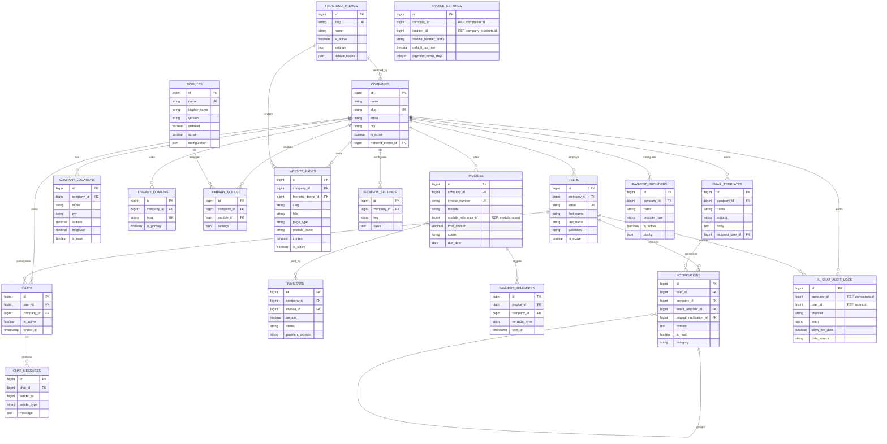
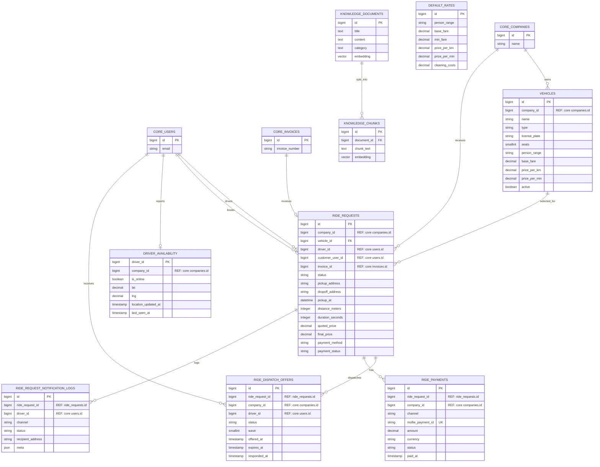
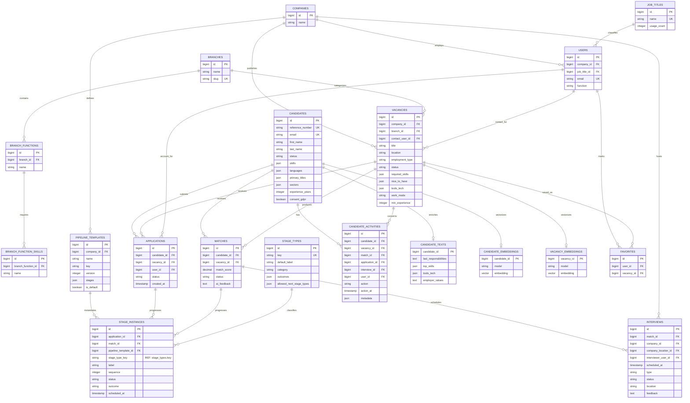

# Nexa database-datamodel

Dit document beschrijft het logische datamodel van:

- **Nexa**: platform, tenants, gebruikers, modules, content, communicatie en facturatie.
- **Nexa Taxi**: voertuigen, ritten, dispatch, betalingen en de AI-kennisbank.
- **Nexa Skillmatching**: vacatures, kandidaten, matches, sollicitaties en recruitment-pipelines.

Bronnen: `app/Database/Pre2026Baseline.php`, `database/migrations/` en
`database/migrations/modules/taxi/`. Het model beschrijft de toestand na alle
migraties tot en met **8 juni 2026**.

## Fysieke indeling

De standaardstrategie is `MODULE_DATABASE_STRATEGY=schema`:

| PostgreSQL-schema | Verantwoordelijkheid |
|---|---|
| `public` | Nexa core en gedeelde platformtabellen |
| `nexa_taxi` | Nexa Taxi |
| `nexa_skillmatching` | Nexa Skillmatching |

Bij de legacy-strategie `database` kunnen modules in aparte databases staan. Daarom
zijn enkele relaties vanuit modules naar core, zoals `company_id`, `driver_id`,
`customer_user_id` en `invoice_id`, bewust alleen logische relaties zonder
database-foreign-key.

Legenda:

- `PK`: primary key
- `FK`: afgedwongen foreign key
- `REF`: logische verwijzing, niet altijd afgedwongen door de database
- `UK`: unique key

## 1. Nexa core

### Core-hulptabellen

| Groep | Tabellen |
|---|---|
| Authenticatie | `password_reset_tokens`, `customer_login_codes`, `personal_access_tokens`, `account_activation_tokens` |
| Autorisatie | `roles`, `permissions`, `model_has_roles`, `model_has_permissions`, `role_has_permissions` |
| Laravel runtime | `sessions`, `cache`, `cache_locks`, `jobs`, `job_batches`, `failed_jobs` |
| Website/media | `website_media`, `info_request_form_fields` |
| Chat legacy/realtime | `chat_rooms`, `chat_participants`, `typing_indicators`, `chat_history` |

## 2. Nexa Taxi

Belangrijke constraints:

- `ride_dispatch_offers` is uniek op `(ride_request_id, driver_id)`.
- `driver_availability` heeft precies één actuele rij per chauffeur.
- `knowledge_documents.embedding` en `knowledge_chunks.embedding` gebruiken
  `vector(1536)` wanneer `pgvector` beschikbaar is, anders tekst.
- `invoices.module = 'taxi'` en `invoices.module_reference_id = ride_requests.id`
  vormen de generieke core-koppeling naar een taxirit.

## 3. Nexa Skillmatching

### Overige Skillmatching-tabellen

| Tabel | Doel |
|---|---|
| `job_configuration_types` | Definieert typen zoals dienstverband, werkuren en vacaturestatus |
| `job_configurations` | Globale of tenant-specifieke waarden per configuratietype |
| `skills` | Vaardigheden op een gebruikersprofiel |
| `experiences` | Werkervaring op een gebruikersprofiel |
| `cv_files` | CV-bestanden van gebruikers |
| `chats` / `chat_messages` | Gesprekken gekoppeld aan kandidaat, match of sollicitatie |

Belangrijke constraints:

- `favorites` is uniek op `(user_id, vacancy_id)`.
- `branch_functions` is uniek op `(branch_id, name)`.
- `branch_function_skills` is uniek op `(branch_function_id, name)`.
- `candidate_texts`, `candidate_embeddings` en `vacancy_embeddings` zijn
  één-op-één uitbreidingen via hun primary key.
- `stage_instances.stage_type_key` verwijst logisch naar `stage_types.key`; er is
  geen database-foreign-key.
- Embeddings gebruiken `vector(1536)` op PostgreSQL met `pgvector`, met JSON als
  fallback in omgevingen zonder de extensie.

## Hoofdprocessen

### Taxi

`company -> vehicle -> ride_request -> dispatch_offer -> driver -> ride_payment/invoice`

### Skillmatching

`company -> vacancy -> candidate match/application -> pipeline stages -> interview/outcome`

### Multi-tenancy

`company` is de tenant-root. Core-data gebruikt waar mogelijk een echte foreign
key naar `companies.id`. Moduledata gebruikt daarnaast `company_id` als
tenant-sleutel, maar die verwijzing is niet overal fysiek afgedwongen vanwege de
ondersteuning voor zowel PostgreSQL-schema's als losse module-databases.
