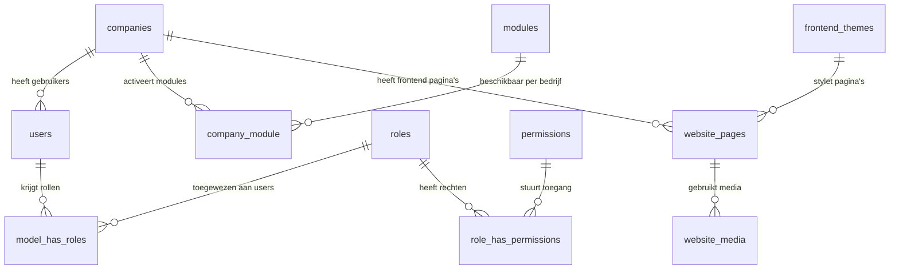
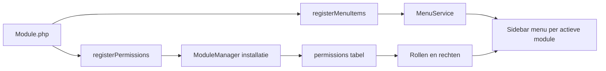
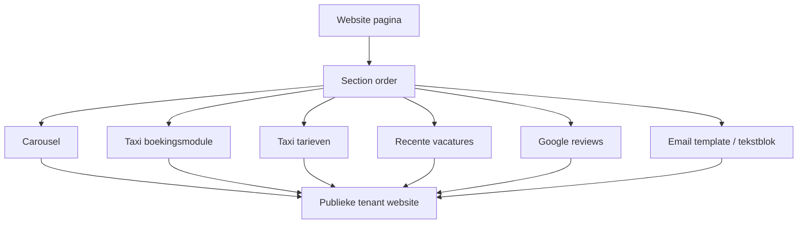
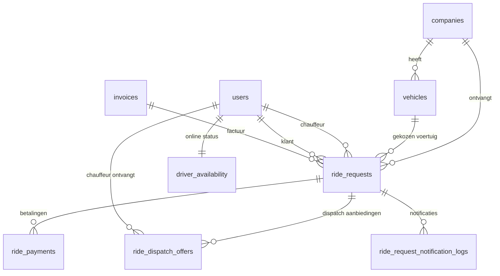
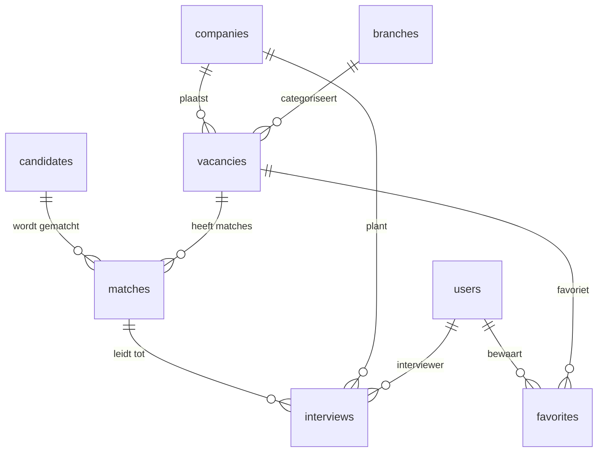

# NEXA SaaS datamodel en productuitleg

Dit document beschrijft het huidige SaaS-product op basis van de codebase, met focus op de modules `taxi` en `skillmatching`. Het is bedoeld als basis voor verkoopmateriaal, website-uitleg en technische productpositionering.

## Productmodel

NEXA is opgebouwd als multi-tenant SaaS-platform met een centrale beheerlaag en activeerbare modules per bedrijf.

### Kernentiteiten

| Entiteit | Rol in het product |
| --- | --- |
| `companies` | Tenant/klantorganisatie met eigen gebruikers, website, modules en instellingen. |
| `modules` | Modulecatalogus met naam, display name, versie, icon, installatie- en activatiestatus. |
| `company_module` | Koppelt bedrijven aan modules en bewaart module-instellingen per bedrijf. |
| `users`, `roles`, `permissions` | Backend admin, chauffeurs, klanten, kandidaten en medewerkers met Spatie rollen/rechten. |
| `frontend_themes` | Beschikbare website-thema's voor tenant-websites. |
| `website_pages` | Pagina's met slug, content, page type, module name, sortering, actiefstatus en theme-koppeling. |
| `website_media` | Versleutelde website media voor o.a. carousel en page-builder assets. |
| `payment_providers`, `invoices`, `payments` | Betalingsproviders, facturen en betaalregistratie voor SaaS en moduleprocessen. |

## Backend admin

De admin is modulair: iedere module registreert zelf menu-items en permissies.

### Taxi admin menu

| Menu-item | Route | Rechten |
| --- | --- | --- |
| Voertuigen | `admin.taxi.vehicles.index` | `vehicles.view`, `vehicles.create`, `vehicles.update`, `vehicles.delete` |
| Tarieven | `admin.taxi.tarieven.edit` | `rates.view`, `rates.update` |
| Ritten | `admin.taxi.ride_requests.index` | `rides.view`, `rides.create`, `rides.update`, `rides.delete` |
| Chauffeur dispatch | `admin.taxi.dispatch_settings.edit` | `rides.view` |

### Skillmatching admin menu

| Menu-item | Route | Rechten |
| --- | --- | --- |
| Branches | `admin.skillmatching.branches.index` | `view-branches` |
| Vacatures | `admin.skillmatching.vacancies.index` | `skillmatching.vacancies.*` |
| Matches | `admin.skillmatching.matches.index` | `skillmatching.matches.*` |
| Interviews | `admin.skillmatching.interviews.index` | `skillmatching.interviews.*` |

## Frontend website builder

Pagina's worden opgebouwd vanuit `website_pages.content` en `section_order`. Componenten worden geregistreerd via `config/frontend_components.php` en gefilterd op module.

Beschikbare componenten in de codebase:

| Component | Module | Doel |
| --- | --- | --- |
| `website.google_reviews` | Algemeen | Reviews carousel voor vertrouwen en conversie. |
| `website.nexa_modules_overview` | Algemeen | Overzicht van NEXA modules op de website. |
| `website.email_template_section` | Algemeen | Herbruikbare contentsectie. |
| `nexa.recente_vacatures` | Skillmatching | Vacaturekaarten op de publieke website. |
| `taxi.tarieven` | Taxi | Tarieven en voertuigcategorieen. |
| `taxi.boekingsmodule` | Taxi | Meerstaps taxi boekingsflow met route, bagage en klantgegevens. |

## Nexa Taxi datamodel

### Taxi mogelijkheden

| Onderdeel | Mogelijkheden |
| --- | --- |
| Ritten | Aanvraag, offerte, betaalstatus, toewijzing, dispatch, voltooiing, annulering, klantgegevens en routegegevens. |
| Voertuigen | Type, kenteken, stoelen, personenrange, actiefstatus, foto, basisprijs, prijs per km/minuut, minimumtarief en schoonmaakkosten. |
| Tarieven | Default rates per personenrange en voertuigspecifieke tarieven. |
| Dispatch | Chauffeur-aanbiedingen, waves, vervaltijd, accepteren/weigeren, redispatch en notificatielog. |
| Chauffeur app | Headless API voor login, beschikbaarheid, inbox, stream, rit starten/vrijgeven/afronden, betalingen en facturen versturen. |
| Betalingen | Mollie checkout, contante betaling, open/paid/failed/canceled/expired statussen en payment payloads. |
| Facturen | Ritfactuur tonen en vanuit chauffeur app verzenden. |

### Chauffeur app API

De chauffeur app is los/headless via `v1/driver` API-routes:

| API-functie | Routegroep |
| --- | --- |
| Authenticatie | `me`, `logout` |
| Beschikbaarheid | `PUT availability` met online status en locatie |
| Dispatch inbox | `GET dispatch/inbox`, `GET dispatch/stream` |
| Aanbiedingen | `accept`, `decline` |
| Ritstatus | `start`, `release`, `complete` |
| Betaling | `GET/POST dispatch/rides/{ride}/payment`, `payment/cash` |
| Factuur | `GET dispatch/rides/{ride}/invoice`, `invoice/send` |

## Nexa Skillmatching datamodel

### Skillmatching mogelijkheden

| Onderdeel | Mogelijkheden |
| --- | --- |
| Vacatures | Titel, locatie, salaris, publicatie, SEO, contactpersoon, branch, eisen, aanbod, benefits, skills en status. |
| Kandidaten | Profiel, CV, motivatie, ervaring, opleiding, salariswens, locatie, skills, talen, beschikbaarheid en consent. |
| Matches | Kandidaat-vacature matchscore, status, AI-aanbeveling, AI-analyse, notities en sollicitatiedatum. |
| Interviews | Planning, duur, type, status, locatie, interviewer, feedback en koppeling aan match/bedrijf. |
| Frontend portaal | Dashboard, vacatures, matches, agenda en vacaturedetails. |
| Website componenten | Recente vacatures en module-overzicht voor leadgeneratie. |

## Verkoopbare productboodschap

Gebruik deze kernboodschap op de website:

> NEXA SaaS combineert een krachtige backend admin, flexibele website builder en losse headless modules. Bedrijven activeren alleen wat ze nodig hebben: taxi boekingen met chauffeur app, of skillmatching met vacatures, kandidaten, matches en interviews.

Sterke punten om zichtbaar te maken:

| Thema | Verkoopwaarde |
| --- | --- |
| Modulair uitbreidbaar | Nieuwe modules voegen automatisch menu-items, rechten en websitecomponenten toe. |
| Multi-tenant | Ieder bedrijf krijgt eigen modules, websitepagina's, instellingen en gebruikers. |
| Website builder | Pagina's kunnen commercieel worden opgebouwd met carousel, formulieren, boeking, tarieven, reviews en vacatureblokken. |
| Headless API | De taxi chauffeur app staat los van de admin en communiceert via API's. |
| Operationele workflows | Taxi: van boeking tot dispatch, betaling en factuur. Skillmatching: van vacature tot match en interview. |
| Rollen en rechten | Admin, bedrijf, medewerker, chauffeur, klant en kandidaat kunnen gericht toegang krijgen. |
| Betaling en facturatie | Mollie, cash flow, factuurregistratie en verzenden vanuit de chauffeur app. |

## Marketingvisuals

Bij dit document horen twee assets:

- `assets/nexa-saas-product-overview.svg`: exacte Nederlandstalige infographic voor website/slidegebruik.
- `assets/nexa-saas-marketing-mockup.png`: gegenereerde sfeer/mockup visual voor marketinghero's.
