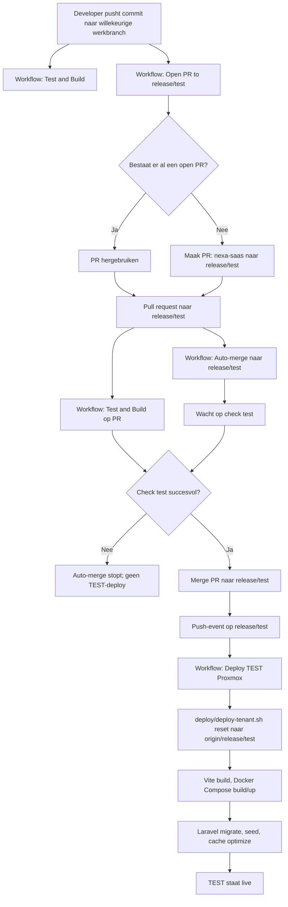
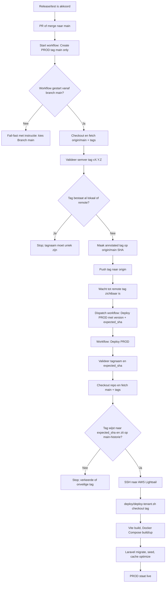
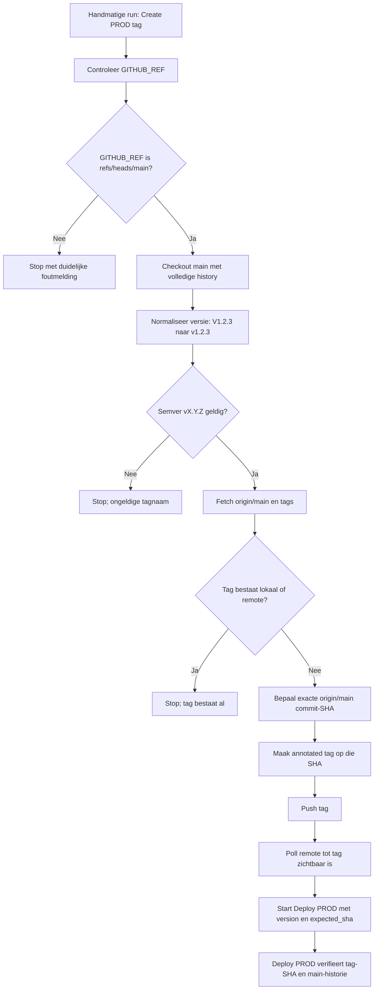

# Deploy schema's

Deze map bevat downloadbare schema's van het ingerichte auto-deployproces.
GitHub rendert de Mermaid-blokken in dit document direct als diagram.

## Downloadbare bestanden

- [deploy-overzicht.png](deploy-overzicht.png) - gecombineerde afbeelding voor Preview op macOS
- [deploy-overzicht.pdf](deploy-overzicht.pdf) - gecombineerde PDF voor Preview op macOS
- [deploy-overzicht.svg](deploy-overzicht.svg) - schaalbare bronafbeelding
- [01-branch-commit-pr-build-automerge-test.mmd](01-branch-commit-pr-build-automerge-test.mmd)
- [02-prod-tag-main-deploy.mmd](02-prod-tag-main-deploy.mmd)
- [03-create-prod-tag-main-only-fix.mmd](03-create-prod-tag-main-only-fix.mmd)

## 1. Commit op branch naar TEST-deploy

## 2. PROD-tag vanaf main naar PROD-deploy

## 3. Fix in Create PROD tag (main only)

## Belangrijke workflows

- `.github/workflows/test.yml`: bouwt assets en draait PHPUnit-tests.
- `.github/workflows/open-pr-to-test.yml`: opent automatisch een PR van elke werkbranch naar `release/test`.
- `.github/workflows/auto-merge-test-pr.yml`: wacht op check `test` en merget de PR naar `release/test`.
- `.github/workflows/deploy-saas.yml`: deployt TEST op push naar `release/test`.
- `.github/workflows/create-prod-tag.yml`: maakt een PROD-tag op `origin/main` en start PROD-deploy.
- `.github/workflows/deploy-prod.yml`: deployt een gevalideerde `v*` tag naar PROD.
