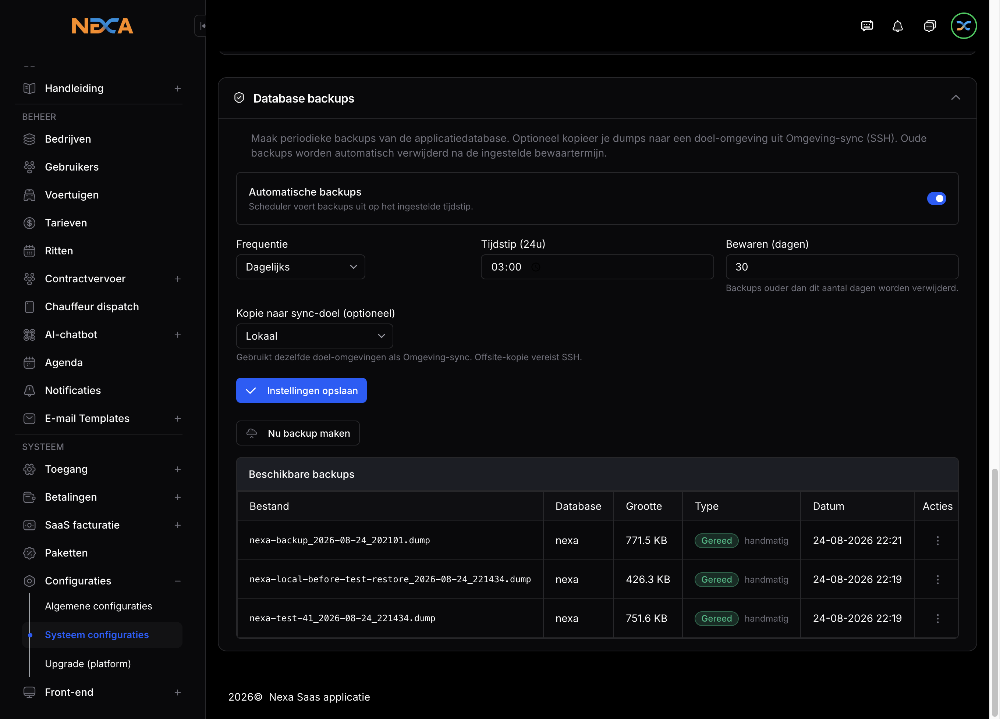
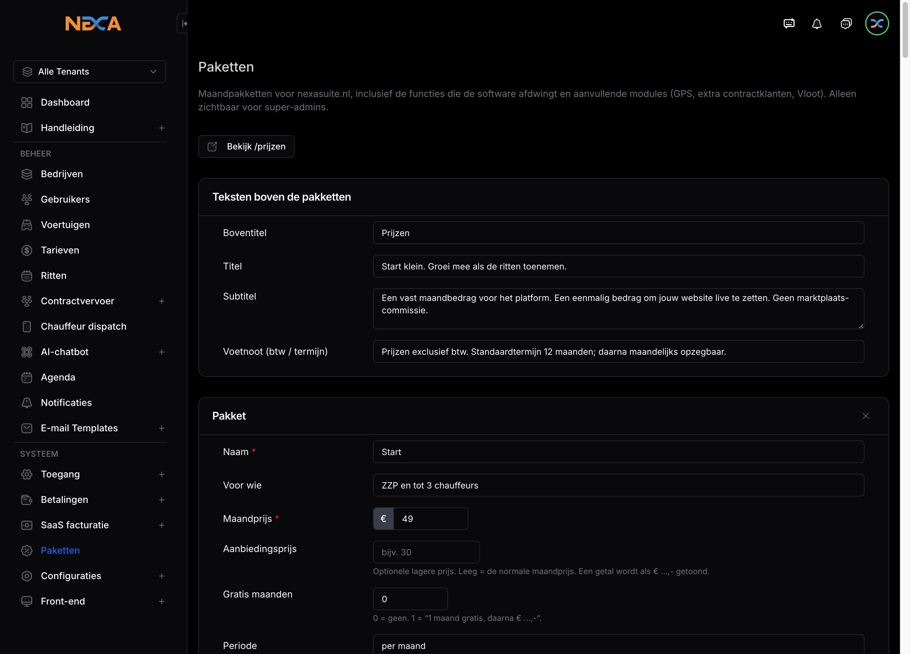
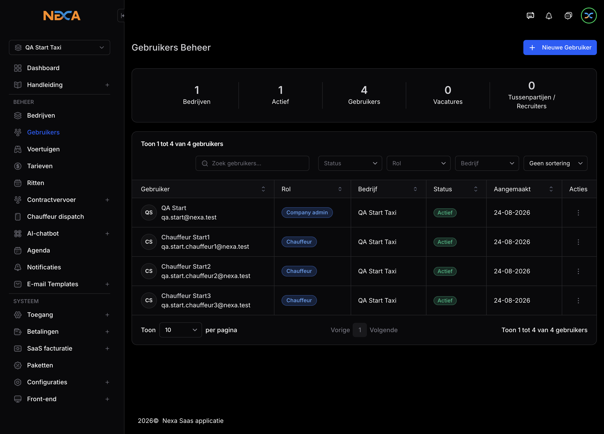
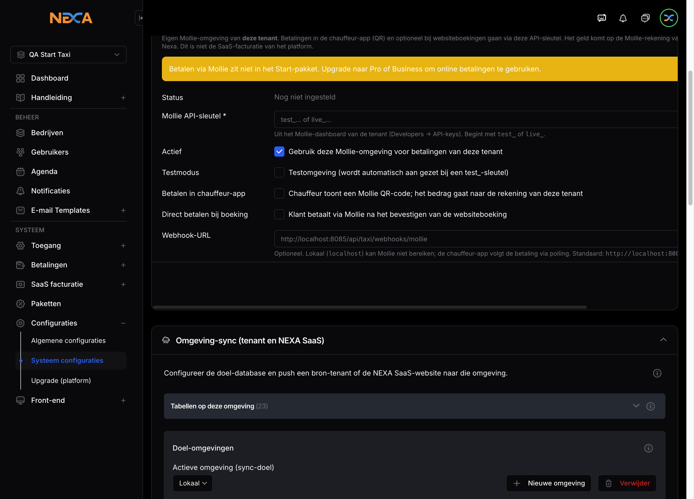

# Testrapport pakketbeperkingen — 24 augustus 2026

Conclusie: **naar wens**. Start / Pro / Business worden afgedwongen in code. Automatische tests: **37/37 geslaagd**.

## QA-accounts (localhost:8085)

| Pakket | Bedrijf | Login | Rol |
| --- | --- | --- | --- |
| Start | QA Start Taxi | qa.start@nexa.test | company-admin |
| Pro | QA Pro Taxi | qa.pro@nexa.test | company-admin |
| Business | QA Business Taxi | qa.business@nexa.test | company-admin |
| — | Platform | qa.pakketten@nexa.test | super-admin |

Wachtwoord testers: `PakketTest2026!`

## Screenshots

### Paketten (catalogus)

### Start: 3 chauffeurs (limiet)

### Start: Mollie geblokkeerd

## Beperkingen

Zie het canvas-rapport naast de chat voor de volledige matrix (Start/Pro/Business).
